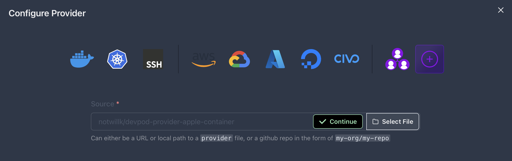

# notwillk/devpod-provider-apple-container

[Apple containerization](https://apple.github.io/containerization/documentation/) provider for [DevPod](https://github.com/loft-sh/devpod)

## Prereqs

- [macOS Tahoe 26](https://developer.apple.com/documentation/macos-release-notes/macos-26-release-notes)
- Install [DevPod](https://github.com/loft-sh/devpod)

## Getting started

## Install via CLI

```sh
devpod provider add notwillk/devpod-provider-apple-container
devpod provider use notwillk/devpod-provider-apple-container
```

## Install via GUI


